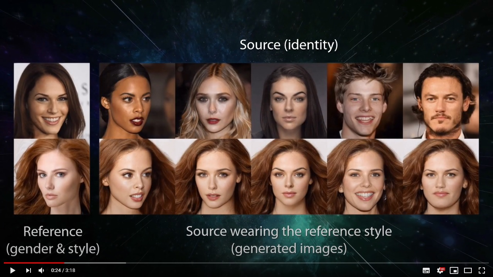
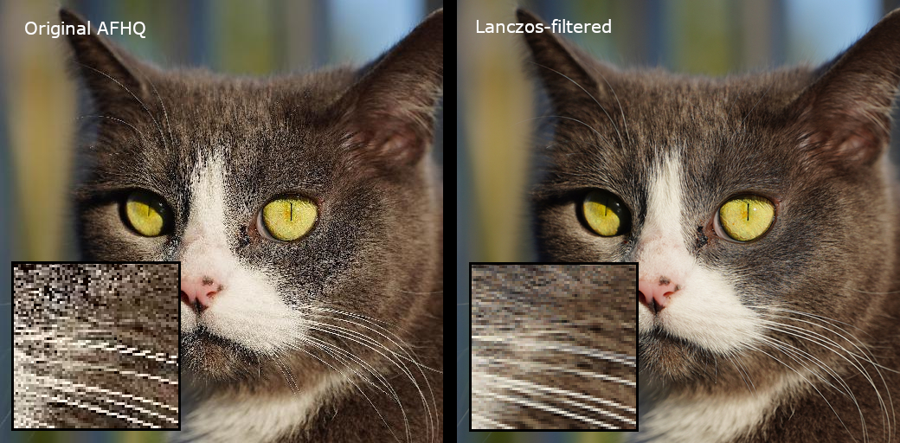

## StarGAN v2 - Official PyTorch Implementation

# google colabで動作させる場合
ローカルで`./colab-90m-measure.py`を実行し、google colabの90mのキャッシュリセットを対策する.
※ 特にライブラリをインストール不要で動作する

```
python colab-90m-measure.py
```
<p align="left"></p>

> **StarGAN v2: Diverse Image Synthesis for Multiple Domains**<br>
> [Yunjey Choi](https://github.com/yunjey)\*, [Youngjung Uh](https://github.com/youngjung)\*, [Jaejun Yoo](http://jaejunyoo.blogspot.com/search/label/kr)\*, [Jung-Woo Ha](https://www.facebook.com/jungwoo.ha.921)<br>
> In CVPR 2020. (* indicates equal contribution)<br>

> Paper: https://arxiv.org/abs/1912.01865<br>
> Video: https://youtu.be/0EVh5Ki4dIY<br>

> **Abstract:** *A good image-to-image translation model should learn a mapping between different visual domains while satisfying the following properties: 1) diversity of generated images and 2) scalability over multiple domains. Existing methods address either of the issues, having limited diversity or multiple models for all domains. We propose StarGAN v2, a single framework that tackles both and shows significantly improved results over the baselines. Experiments on CelebA-HQ and a new animal faces dataset (AFHQ) validate our superiority in terms of visual quality, diversity, and scalability. To better assess image-to-image translation models, we release AFHQ, high-quality animal faces with large inter- and intra-domain variations. The code, pre-trained models, and dataset are available at clovaai/stargan-v2.*

## Teaser video
Click the figure to watch the teaser video. <br/>

[](https://youtu.be/0EVh5Ki4dIY)

## TensorFlow implementation
The TensorFlow implementation of StarGAN v2 by our team member junho can be found at [clovaai/stargan-v2-tensorflow](https://github.com/clovaai/stargan-v2-tensorflow).

## Software installation
Clone this repository:

```bash
git clone https://github.com/clovaai/stargan-v2.git
cd stargan-v2/
```

Install the dependencies:
```bash
python3.9 -m venv venv
source venv/bin/activate
conda create -n stargan-v2 python=3.6.7
conda activate stargan-v2
conda install -y pytorch=1.4.0 torchvision=0.5.0 cudatoolkit=10.0 -c pytorch
conda install x264=='1!152.20180717' ffmpeg=4.0.2 -c conda-forge
pip install opencv-python==4.1.2.30 ffmpeg-python==0.2.0 scikit-image==0.16.2
pip install pillow==7.0.0 scipy==1.2.1 tqdm==4.43.0 munch==2.5.0
```
****
## Datasets and pre-trained networks
We provide a script to download datasets used in StarGAN v2 and the corresponding pre-trained networks. The datasets and network checkpoints will be downloaded and stored in the `data` and `expr/checkpoints` directories, respectively.

<b>CelebA-HQ.</b> To download the [CelebA-HQ](https://drive.google.com/drive/folders/0B4qLcYyJmiz0TXY1NG02bzZVRGs) dataset and the pre-trained network, run the following commands:
```bash
bash download.sh celeba-hq-dataset
bash download.sh pretrained-network-celeba-hq
bash download.sh wing
```

<b>AFHQ.</b> To download the [AFHQ](https://github.com/clovaai/stargan-v2/blob/master/README.md#animal-faces-hq-dataset-afhq) dataset and the pre-trained network, run the following commands:
```bash
bash download.sh afhq-dataset
bash download.sh pretrained-network-afhq
```


## Generating interpolation videos
After downloading the pre-trained networks, you can synthesize output images reflecting diverse styles (e.g., hairstyle) of reference images. The following commands will save generated images and interpolation videos to the `expr/results` directory.


<b>CelebA-HQ.</b> To generate images and interpolation videos, run the following command:
```bash
python main.py --mode sample --num_domains 2 --resume_iter 100000 --w_hpf 1 \
               --checkpoint_dir expr/checkpoints/celeba_hq \
               --result_dir expr/results/celeba_hq \
               --src_dir assets/representative/celeba_hq/src \
               --ref_dir assets/representative/celeba_hq/ref
```

To transform a custom image, first crop the image manually so that the proportion of face occupied in the whole is similar to that of CelebA-HQ. Then, run the following command for additional fine rotation and cropping. All custom images in the `inp_dir` directory will be aligned and stored in the `out_dir` directory.

```bash
python main.py --mode align \
               --inp_dir assets/representative/custom/female \
               --out_dir assets/representative/celeba_hq/src/female

# by_time_zoneモデル
python main.py --mode align \
               --inp_dir assets/representative/by_time_zone/12 \
               --out_dir assets/representative/by_time_zone/src/12

python main.py --mode align \
               --inp_dir assets/representative/by_time_zone/18 \
               --out_dir assets/representative/by_time_zone/src/18

python main.py --mode align \
               --inp_dir assets/representative/by_time_zone/21 \
               --out_dir assets/representative/by_time_zone/src/21
```


<p align="left"></p>


<b>AFHQ.</b> To generate images and interpolation videos, run the following command:
```bash
python main.py --mode sample --num_domains 3 --resume_iter 100000 --w_hpf 0 \
               --checkpoint_dir expr/checkpoints/afhq \
               --result_dir expr/results/afhq \
               --src_dir assets/representative/afhq/src \
               --ref_dir assets/representative/afhq/ref
```

<p align="left"></p>

## Evaluation metrics
To evaluate StarGAN v2 using [Fr&eacute;chet Inception Distance (FID)](https://arxiv.org/abs/1706.08500) and [Learned Perceptual Image Patch Similarity (LPIPS)](https://arxiv.org/abs/1801.03924), run the following commands:


```bash
# celeba-hq
python main.py --mode eval --num_domains 2 --w_hpf 1 \
               --resume_iter 100000 \
               --train_img_dir data/celeba_hq/train \
               --val_img_dir data/celeba_hq/val \
               --checkpoint_dir expr/checkpoints/celeba_hq \
               --eval_dir expr/eval/celeba_hq

# afhq
python main.py --mode eval --num_domains 3 --w_hpf 0 \
               --resume_iter 100000 \
               --train_img_dir data/afhq/train \
               --val_img_dir data/afhq/val \
               --checkpoint_dir expr/checkpoints/afhq \
               --eval_dir expr/eval/afhq

# by_time_zone
python main.py --mode eval --num_domains 3 --w_hpf 0 \
               --resume_iter 100 \
               --train_img_dir data/by_time_zone/train \
               --val_img_dir data/by_time_zone/val \
               --checkpoint_dir expr/checkpoints/by_time_zone \
               --eval_dir expr/eval/by_time_zone \
               --result_dir expr/results/by_time_zone \
               --batch_size 4 \
               --total_iters 100 \
               --eval_every 100 \
               --num_workers 4 \
               --val_batch_size 8


# options
--randcrop_prob : ランダムクロップを使用する確率を設定します。デフォルトでは50%に設定されています。
--total_iters : 学習するイテレーションの合計回数を設定します。デフォルトでは100,000に設定されています。
--resume_iter : 学習を再開するイテレーションを設定します。デフォルトでは0に設定されています。
--batch_size : 学習時のバッチサイズを設定します。デフォルトでは8に設定されています。
--val_batch_size : 検証時のバッチサイズを設定します。デフォルトでは32に設定されています。
--lr : D、E、Gに使用する学習率を設定します。デフォルトでは1e-4に設定されています。
--f_lr : Fに使用する学習率を設定します。デフォルトでは1e-6に設定されています。
--beta1 : Adam最適化における1つ目のモーメントの減衰率を設定します。デフォルトでは0に設定されています。
--beta2 : Adam最適化における2つ目のモーメントの減衰率を設定します。デフォルトでは0.99に設定されています。
--weight_decay : オプティマイザに対するウェイトディケイを設定します。デフォルトでは1e-4に設定されています。
--num_outs_per_domain : 1つのドメインに対して生成される画像の数を設定します。デフォルトでは10に設定されています。
```

Note that the evaluation metrics are calculated using random latent vectors or reference images, both of which are selected by the [seed number](https://github.com/clovaai/stargan-v2/blob/master/main.py#L35). In the paper, we reported the average of values from 10 measurements using different seed numbers. The following table shows the calculated values for both latent-guided and reference-guided synthesis.

| Dataset  |  FID (latent)   |  LPIPS (latent)  |  FID (reference)  | LPIPS (reference) |  Elapsed time   |
| :---------- | :------------: | :----: | :-----: | :----: | :----------:|
| `celeba-hq` | 13.73 &pm; 0.06 | 0.4515 &pm; 0.0006  | 23.84  &pm; 0.03 | 0.3880 &pm; 0.0001 | 49min 51s
| `afhq` | 16.18 &pm; 0.15 | 0.4501 &pm; 0.0007 | 19.78 &pm; 0.01 | 0.4315 &pm; 0.0002 | 64min 49s


## Training networks
To train StarGAN v2 from scratch, run the following commands. Generated images and network checkpoints will be stored in the `expr/samples` and `expr/checkpoints` directories, respectively. Training takes about three days on a single Tesla V100 GPU. Please see [here](https://github.com/clovaai/stargan-v2/blob/master/main.py#L86-L179) for training arguments and a description of them.

```bash
# celeba-hq
python main.py --mode train --num_domains 2 --w_hpf 1 \
               --lambda_reg 1 --lambda_sty 1 --lambda_ds 1 --lambda_cyc 1 \
               --train_img_dir data/celeba_hq/train \
               --val_img_dir data/celeba_hq/val

# afhq
python main.py --mode train --num_domains 3 --w_hpf 0 \
               --lambda_reg 1 --lambda_sty 1 --lambda_ds 2 --lambda_cyc 1 \
               --train_img_dir data/afhq/train \
               --val_img_dir data/afhq/val

# by_time_zone
python main.py --mode train --num_domains 3 --w_hpf 0 \
               --lambda_reg 1 --lambda_sty 1 --lambda_ds 2 --lambda_cyc 1 \
               --train_img_dir data/by_time_zone/train \
               --val_img_dir data/by_time_zone/val \
               --sample_dir expr/by_time_zone/samples \
               --result_dir expr/by_time_zone \
               --checkpoint_dir expr/checkpoints/by_time_zone \
               --batch_size 4 \
               --total_iters 20 \
               --sample_every 10 \
               --save_every 10 \
               --eval_every 10 \
               --val_batch_size 8
```
> トレーニング時間
> google colab × conda環境, GPU Tesla T4
> バッチ数4の場合→ epoch数: 10(40s~1m), 100(10m), 1000(1h), 10000(10h), 100000(100h)
> google colab（無料枠）での実行環境
> バッチ数8の場合：動作しない（GPUが足りない）
> epoch数（--total_iters）が5000くらいが限界？

## Animal Faces-HQ dataset (AFHQ)

<p align="left"></p>

We release a new dataset of animal faces, Animal Faces-HQ (AFHQ), consisting of 15,000 high-quality images at 512×512 resolution. The figure above shows example images of the AFHQ dataset. The dataset includes three domains of cat, dog, and wildlife, each providing about 5000 images. By having multiple (three) domains and diverse images of various breeds per each domain, AFHQ sets a challenging image-to-image translation problem. For each domain, we select 500 images as a test set and provide all remaining images as a training set. To download the dataset, run the following command:

```bash
bash download.sh afhq-dataset
```


**[Update: 2021.07.01]** We rebuild the original AFHQ dataset by using high-quality resize filtering (i.e., Lanczos resampling). Please see the [clean FID paper](https://arxiv.org/abs/2104.11222) that brings attention to the unfortunate software library situation for downsampling. We thank to [Alias-Free GAN](https://nvlabs.github.io/alias-free-gan/) authors for their suggestion and contribution to the updated AFHQ dataset. If you use the updated dataset, we recommend to cite not only our paper but also their paper.

The differences from the original dataset are as follows:
* We resize the images using Lanczos resampling instead of nearest neighbor downsampling.
* About 2% of the original images had been removed. So the set is now has 15803 images, whereas the original had 16130.
* Images are saved as PNG format to avoid compression artifacts. This makes the files bigger than the original, but it's worth it.


To download the updated dataset, run the following command:

```bash
bash download.sh afhq-v2-dataset
```

<p align="left"></p>


## License
The source code, pre-trained models, and dataset are available under [Creative Commons BY-NC 4.0](https://github.com/clovaai/stargan-v2/blob/master/LICENSE) license by NAVER Corporation. You can **use, copy, tranform and build upon** the material for **non-commercial purposes** as long as you give **appropriate credit** by citing our paper, and indicate if changes were made.

For business inquiries, please contact clova-jobs@navercorp.com.<br/>
For technical and other inquires, please contact yunjey.choi@navercorp.com.


## Citation
If you find this work useful for your research, please cite our paper:

```
@inproceedings{choi2020starganv2,
  title={StarGAN v2: Diverse Image Synthesis for Multiple Domains},
  author={Yunjey Choi and Youngjung Uh and Jaejun Yoo and Jung-Woo Ha},
  booktitle={Proceedings of the IEEE Conference on Computer Vision and Pattern Recognition},
  year={2020}
}
```

## Acknowledgements
We would like to thank the full-time and visiting Clova AI Research (now NAVER AI Lab) members for their valuable feedback and an early review: especially Seongjoon Oh, Junsuk Choe, Muhammad Ferjad Naeem, and Kyungjune Baek. We also thank Alias-Free GAN authors for their contribution to the updated AFHQ dataset.

# 聞きたいこと
- 学習の段階で輝度情報を重みとして画像ごとに付与することは可能か
  - 可能である。一般的にロス関数にweightを引数として付与することが多い
  -